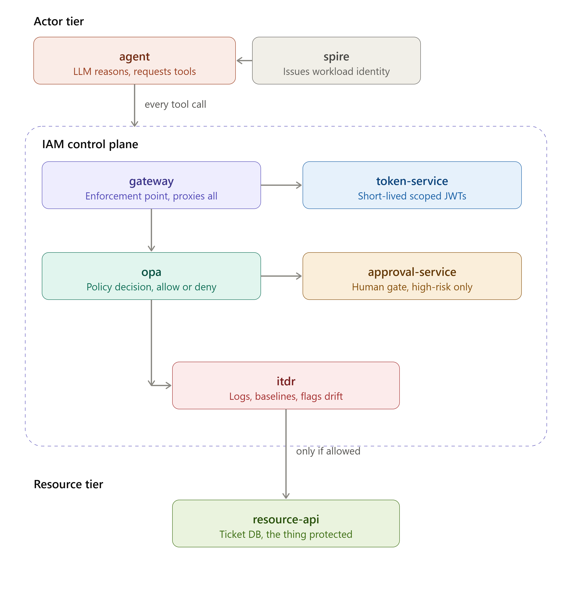
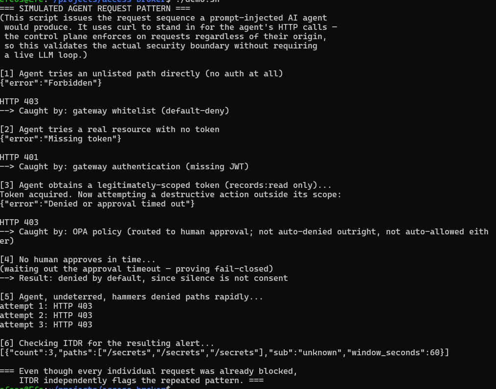

# AI Agent Access Broker

**An externalized IAM control plane for AI agents — built to prove that a fully compromised agent identity still cannot act outside its authorized boundary.**



> **Scope note:** This project builds and proves the *IAM control plane* an AI agent's requests must pass through — the enforcement infrastructure, not a live LLM agent itself. `resource-api` is a static mock resource; `demo.sh` uses `curl` to simulate the exact request pattern a prompt-injected agent would produce. The control plane's enforcement doesn't depend on what generated the request — a curl call and a compromised agent's tool call look identical at the gateway — so this validates the real security property. **Future work:** swap the simulated client for a live LLM agent (Claude/GPT with tool-calling) reading a document containing a genuine injected instruction.

---

## The idea

Give an AI agent a static API key and one prompt injection is all it takes to hand an attacker everything that key can touch. This system takes the opposite approach: **the agent's identity is never trusted directly.** Every action has to clear a chain of independent, externally-enforced controls before it reaches real data — and even if the agent itself is fully compromised, it cannot talk its way past a layer that isn't listening to it.

**Defense in depth, done properly:** the layers are separate services with separate trust boundaries, so breaching one doesn't weaken the others. And because every control is *external* to the agent, a prompt-injected agent must still pass enforcement it has no ability to influence.

| # | Component | Role |
|---|---|---|
| 1 | [`resource-api`](#1--resource-api) | The protected resource (deliberately unsecured) |
| 2 | [`gateway`](#2--gateway) | Single entry point — default-deny whitelisting |
| 3 | [`token-service`](#3--token-service) | Short-lived, scoped credentials (JWT) |
| 4 | [`opa`](#4--opa-policy-layer) | Externalized, editable authorization policy |
| 5 | [`approval-service`](#5--approval-service) | Human-in-the-loop gate, fail-closed |
| 6 | [`spire`](#6--spire-workload-identity) | Cryptographic workload identity |
| 7 | [`itdr`](#7--itdr) | Pattern-based threat detection |
| 🎯 | [`demo.sh`](#centerpiece-demo) | Simulated attack — proves the whole chain |

---

## Quick start

```bash
git clone <repo> && cd access-broker
docker compose up --build      # brings up all 8 services

# in a second terminal:
./demo.sh                      # runs the full simulated-attack walkthrough
```

<details>
<summary><strong>Manual verification commands</strong> (click to expand)</summary>

```bash
# resource-api is locked away — only reachable through the gateway
curl localhost:8000/records                                     # 401 — no token

# mint a scoped, short-lived token
TOKEN=$(curl -s -X POST localhost:8001/token | python3 -c "import sys,json; print(json.load(sys.stdin)['token'])")

curl -H "Authorization: Bearer $TOKEN" localhost:8000/records   # 200 — allowed
curl -H "Authorization: Bearer $TOKEN" localhost:8000/admin     # 403 — not whitelisted

# prove policy is externalized: edit opa/policies/authz.rego, then
docker compose restart opa
curl -H "Authorization: Bearer $TOKEN" localhost:8000/records   # decision changes — zero gateway code touched

# check the detection layer
curl localhost:8003/alerts
```
</details>

---

## Architecture

```
client / agent
      │
      ▼
 ┌─────────┐   whitelist + JWT verify   ┌─────────┐   policy check   ┌─────┐
 │ gateway │ ─────────────────────────▶ │  (OPA)  │ ◀───────────────▶│ OPA │
 └─────────┘                            └─────────┘                  └─────┘
      │  requires_approval                    │ allow
      ▼                                        ▼
┌─────────────────┐                    ┌──────────────┐
│ approval-service │  (fail-closed)     │ resource-api │
└─────────────────┘                    └──────────────┘
      │
      ▼
   ┌──────┐        every decision logged        ┌──────┐
   │ ITDR │ ◀──────────────────────────────────  │ log  │
   └──────┘        pattern detection             └──────┘

   SPIRE server + agent issue cryptographic identity to each service
```

---

## Components

### 1 · `resource-api`
The protected resource at the center of the system — deliberately unsecured, so every later layer's job is visible by contrast.

- `GET /health` — liveness
- `GET /records` — mock sensitive data (names, emails, SSNs), no auth of its own

```bash
curl localhost:8000/health   # {"status": "ok"}
```

**Principle:** none yet — this is the unguarded baseline the rest of the system exists to fix.

---

### 2 · `gateway`
The single entry point. `resource-api`'s host port was removed — it's now reachable **only** through the gateway, inside the Docker network.

- Catch-all route checks every path against an explicit allow-list — anything unlisted is `403`'d before it goes anywhere.
- Whitelisted requests are forwarded to `resource-api` by Compose service name (not IP — names are stable, container IPs aren't).

**Principles:** default-deny allowlisting · single choke point (attack surface reduced to one controlled door).

---

### 3 · `token-service`
Issues short-lived, scoped JWTs instead of a standing API key.

| Claim | Purpose |
|---|---|
| `sub` | caller identity |
| `scope` | what the token permits, e.g. `records:read` |
| `exp` | 10-minute expiry |

Signed with **HS256** using a `SECRET_KEY` shared between `token-service` and `gateway` via a root-level `.env` (git-ignored) injected through Compose — one source of truth, never hardcoded, never duplicated.

> A JWT is *signed*, not *encrypted* — anyone can read the claims, no one can forge them without the key. The token carries identity data (safe to be public); the *signing key* is the actual secret worth protecting.

The gateway verifies every non-`/health` request:

| Failure | Status | Meaning |
|---|---|---|
| missing / invalid / expired token | `401` | *I don't know who you are* |
| unlisted path, or valid token with wrong scope | `403` | *I know who you are — you're not allowed* |

**Principles:** short-lived credentials (limited leak window) · scoped access / least privilege (limited blast radius) · no standing secrets (RFC 8693 token-exchange model) · stateless verification (gateway needs no call back to token-service — the signature is self-contained proof).

---

### 4 · `opa` (policy layer)
Authorization moves from hardcoded `if` statements into **externalized, declarative policy** — editable without touching or redeploying the gateway.

```rego
package authz

default decision := "deny"

decision := "allow" if {
    input.path == "/health"
}

decision := "allow" if {
    input.path == "/records"
    input.scope == "records:read"
}

decision := "requires_approval" if {
    input.path == "/delete-records"
    input.scope == "records:read"
}
```

The gateway sends `{scope, path}` to `POST /v1/data/authz/decision` and acts on a three-way answer — `allow`, `deny`, or `requires_approval` — rather than a bare boolean.

```bash
docker compose restart opa   # policy changes apply with zero app-code changes
```

**Principles:** policy as data, not code · default-deny by construction (`default decision := "deny"`) · separation of duties (security owns policy, engineering owns the gateway).

---

### 5 · `approval-service`
Some actions shouldn't get an automated final answer. A `requires_approval` decision routes here instead of an instant allow/deny.

- `POST /approvals` → creates a pending entry, returns an ID
- `GET /approvals` / `GET /approvals/<id>` → check status
- `POST /approvals/<id>/decide` → human approves or denies

The gateway **polls** the pending entry on a timeout. If no human responds in time, the request is treated as **denied** — fail-closed, not fail-open, because a control that quietly opens under silence is a control an attacker can defeat just by making you busy.

**Principle:** human-in-the-loop for high-risk actions, fail-closed by design.

---

### 6 · `SPIRE` (workload identity)
Every prior layer still trusts *network position* — "whatever answers on `http://resource-api:8000` is resource-api." SPIRE replaces that assumption with cryptographic proof.

- SPIRE Server: self-signed CA, 24h TTL
- SPIRE Agent: attested via join-token, holds its own SVID
- Registration entries bind Docker labels → SPIFFE IDs:
  `spiffe://access-broker.local/gateway`, `.../resource-api`

```bash
docker compose exec spire-server /opt/spire/bin/spire-server entry show
```

<details>
<summary><strong>Honest scope note</strong> — bootstrapped for demo purposes, not production-hardened</summary>

- **Join-token attestation** used to bring the agent online (a manually generated, single-use token) — production would use platform-native attestation (e.g. verified AWS/K8s identity), no manual token required.
- **`insecure_bootstrap = true`** skips verifying the server's own cert on first contact — production would provision a pre-shared trust bundle.
- **Full mTLS enforcement between services was scoped out.** The identity infrastructure (server, agent, CA, registered workload identities) is real and proven end-to-end; wiring Flask services to present/verify SVIDs on every request (`py-spiffe`) is the identified next increment.
</details>

**Principle:** identity independent of network position — cryptographically issued and verified by a trust root, not assumed from a hostname.

---

### 7 · `ITDR`
Every prior layer makes a **single-request** decision. ITDR watches the **pattern across requests** — catching what individually-correct enforcement can't see on its own.

- Gateway appends every decision (JSON-lines) to a shared volume: `{timestamp, sub, path, decision}`
- ITDR scans the log: **3+ denials from the same `sub` within 60 seconds → flagged**

```bash
curl localhost:8003/alerts   # returns flagged patterns
curl localhost:8003/log      # raw decision feed
```

**Principle:** detective control layered on top of preventive ones — an agent that keeps retrying after being blocked gets caught by the layer watching for *persistence*, not just the individual attempt.

---

## Centerpiece demo

`demo.sh` walks a simulated prompt-injected agent through the full stack, live:

| Step | Attempt | Result | Caught by |
|---|---|---|---|
| 1 | Unlisted path, no auth | `403` | Gateway whitelist |
| 2 | Real resource, no token | `401` | Gateway authentication |
| 3 | Valid token, wrong-scope destructive action | `403` | OPA → approval → fail-closed timeout |
| 4 | No human responds in time | denied | approval-service |
| 5 | Rapid repeated attempts | `403` × 3 | Still blocked individually |
| 6 | Same pattern, viewed in aggregate | 🚩 flagged | ITDR |

```bash
docker compose up --build
./demo.sh
```

**The point:** no single control is the whole story. A fully compromised, persistently retrying agent identity has to clear five independent layers — and if it keeps trying anyway, a sixth, watching for the *pattern* rather than any one request, catches that too.



---

## Stack

Python · Flask · Docker Compose · PyJWT · Open Policy Agent (Rego) · SPIRE (SPIFFE) · JSON-lines logging

## Project structure

```
access-broker/
├── docker-compose.yml
├── demo.sh
├── resource-api/
├── gateway/
├── token-service/
├── opa/policies/authz.rego
├── approval-service/
├── spire/{server,agent}/
└── itdr/
```
